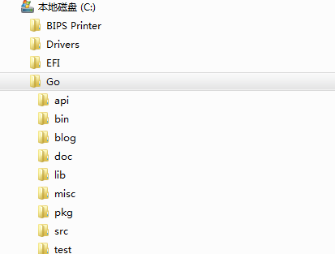
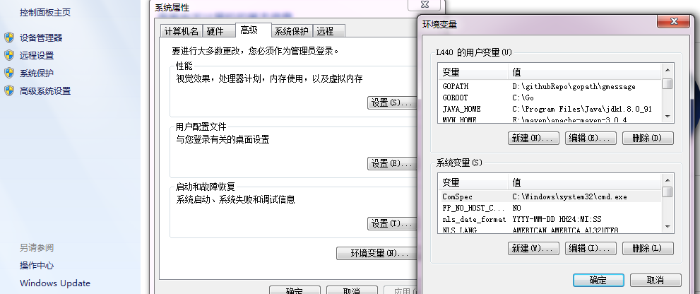
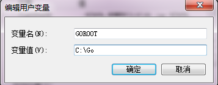
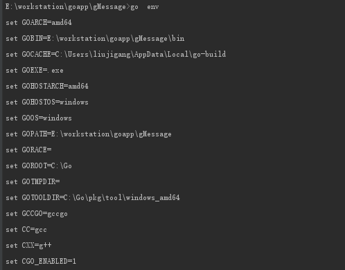
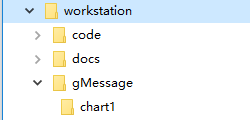
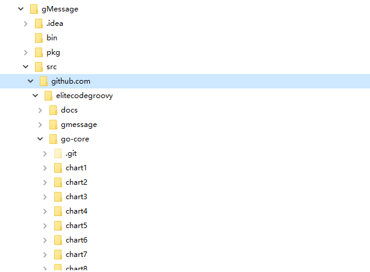

## 1.3学习之旅

### 1.3.1安装Go工具

在开发Go语言前，必须安装Go工具。Go语言官方网站（https://golang.org）下载最新的开发工具包，目前最新版本为1.12。如果由于网络限制，可以到网盘（ https://pan.baidu.com/s/1zb5OQ3yeDL-Vx9WKnKddtw 提取码: 64z9）下载 。操作系统Windows、Linux和Mac OS X上安装Go工具是大同小异，只需要设置环境变量GOROOT、GOBIN和GOPATH即可，本书以Windows平台展示如何安装Go的安装包。

下载go1.10.3.windows-amd64.zip后，解压文件并将文件复杂到C盘下面，呈现的目录见图1.6。




配置Go统计环境变量。设置GOROOT、GOBIN和GOPATH系统环境变量。在Windows机器上，右键点击“计算机”，选择 “属性”，点击“高级系统设置”，再选择“高级”面板，点击“环境变量”，可以设置用户级别或者系统级别的环境变量，见图1.7。




点击“新建”按钮，设置环境变量（设置GOROOT，见图1.8）。 
```
GOROOT=C:\Go
GOPATH=E:\workstation\goapp\gMessage
GOBIN=%GOPATH%\bin
PATH=.;%GOROOT%\bin;%GOBIN%;

```

GOPATH表示的是GO语言应用程序的工作目录，比如某个项目路径E:\workstation\goapp\gMessage，这里的项目名称是gMessage。另外，需要在项目gMessage下面创建三个子目录，它们分别是bin、pkg和src。设置好GOROOT、GOBIN、GOPATH、PATH后，打开cmd运行界面，执行和go version，见图1-9。





### 1.3.2运行Go程序

配置好Go工具后，创建应用程序的运行环境。假定应用程序的目录为E:\workstation\goapp\gMessage，目录结构见图1.20（以本书的源代码为例）。




在src目录下创建目录chart1/hello，并且在这个目录下创建文件hello.go。源代码：

```
package main

import "fmt"

func main(){
   var obj = "Golang"
   fmt.Println("Hello,", obj, "!")
}
```


进入对应目录下，使用下面命令编译和执行程序。
```
>go build -o hello.exe
>hello.exe
Hello, Golang!
```

` go build`编译当前目录下go语言的源代码，参数标记-o是输出编译后的执行文件名称。运行程序hello.exe后，控制台输出程序的执行结果。
 
Go语言的集成开发环境很多，推荐使用IntelliJ和Visual Studio Code。主要是调试方便，便于定位项目中的bugs。决定使用那种集成开发环境，请根据自己的编程偏好而做选择。适合别人的，不一定适合自己。世界本来就没有最好的集成开发环境，只有最好的程序员。

如果想将本书的源代码下载到项目gMessage目录下面，只需通过命令go get获取。
```
go get https://github.com/elitecodegroovy/go-core

```

形成的目录结构见图1-21。




1.3.3	构建约束

构建约束就是一个构建标签，定义在一个源代码文件的开头位置，接下来的一行保持是空白行。见下面的定义：

```
// +build
```

通过构建约束的定义可以让该Go文件仅支持该平台构建，其它平台构建时会被忽略。假设我们定义某个Go源代码文件时，想让这个文件仅在windows平台时才被构建，其它平台一律被忽略。按照这种需求，构建约束可以定义为：

```
// +build windows 
```

假设除了windows平台以外的其它平台上构建该文件的源代码，可以定义为：

```
// +build !windows
```

另外，也可以指定具体的平台名称，包括CPU是32位还是64位。比如，仅支持32位Linux或者darwin系统上构建这个源文件，可以定义为：

```
// +build linux,386 darwin,
```

除了指定操作系统和CPU的架构外，还可以指定Go工具的编译器版本。
```
- "cgo", if ctxt.CgoEnabled is true
- "go1.1", from Go version 1.1 onward
- "go1.2", from Go version 1.2 onward
- "go1.3", from Go version 1.3 onward
- "go1.4", from Go version 1.4 onward
- "go1.5", from Go version 1.5 onward
- "go1.6", from Go version 1.6 onward
- "go1.7", from Go version 1.7 onward
- "go1.8", from Go version 1.8 onward
- "go1.9", from Go version 1.9 onward
- "go1.10", from Go version 1.10 onward

```

指定了具体的编译器就说明仅该编译器才会构建对于源代码文件。Go规范中，以_test为后缀的文件都是测试文件。此外，也可以按照下面格式指定构建的约束平台和CPU的架构：
```
*_GOOS
*_GOARCH
*_GOOS_GOARCH
```

实例文件，见本章节的源代码路径chart1/build。

Go语言的极简哲学还体现在它的全新商标（logo）上，见图1-22。接下来的几个章节，让我们开启学习Go语言的基础知识。


## 1.4小结

本章节主要围绕这Go语言的发展背景、发展状况和为什么学习Go语言三个方面介绍Go语言。最后，通过成功安装Go工具，编译和执行了一个简单的Go文件。接下来的章节将深入Go语言编程，接触Go语言编程的核心技术要点。

学习或者研究Go语言，需要掌握两项基本的技能：


1. 学会翻墙。国外的网站可能无法访问，这时候就需要利用翻墙工具解决。

2. 阅读英文的能力。看国外的技术资料基本上都是使用英语表达的，想学好技能，先学好英文是基本前提。

版权归本人所有，禁止任何转载或者商业用途。
