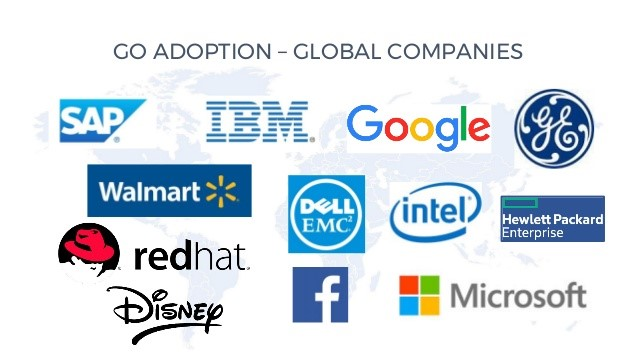
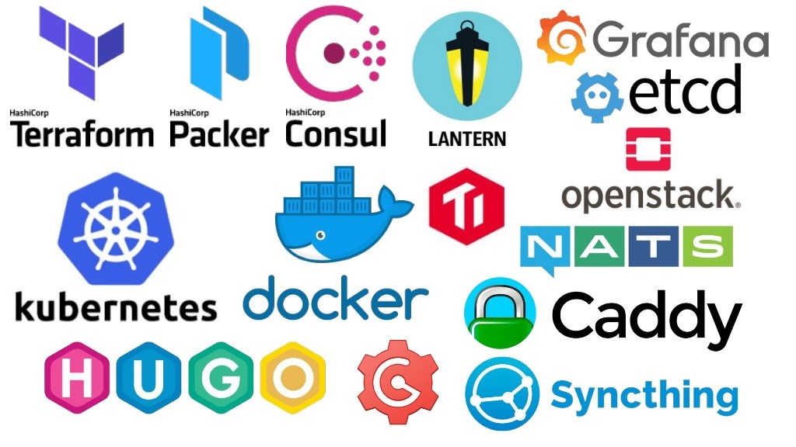
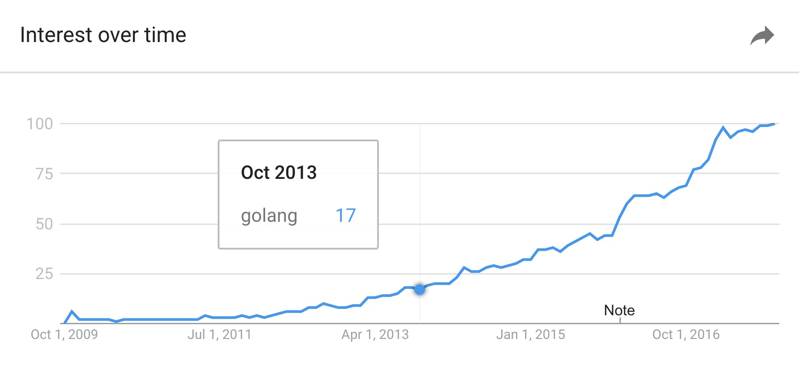

在本章节，笔者会对Go语言的发展历史做一下回顾。进而说明为什么要学习Go，Go语言在实际工程中具有那些优势。

## 1.1历史背景

Go的吉祥物Gordon田鼠（见图1-1），是由Google公司创造的一种新程序语言，并且公司为这门语言付出了极大的努力。Go语言一出现就获得业界的普遍关注和使用。为什么呢？

                                                    

Go具有一些多数程序语言没有的资产。首先，这是一个Google计划，它有数量庞大的服务器和技术高超的程序设计师为后盾。Google的一个实验产品可能比许多其他公司的实际产品更具商业意义。2007年，Google公司的三位核心人员罗伯特·格瑞史莫(Robert Griesemer)、罗布·派克(Rob Pike)和肯·汤普森(Ken Thompson)共同设计出了Go语言，其语言定位为系统编程语言。

Go语言是一个编译的，静态类型的语言，具备垃圾收集（garbage collection），限定性结构类型（structural typing），内存安全（memory safety）以及CSP样式的并发编（concurrent programming ）程等功能特性。
Go语言在2009年被Google正式发布，并且已经在Google生产系统之中使用。同时，也有其他公司在使用这门新的语言。两个主要实现存在：Google的Go编译器，即垃圾回收器（GC）。一个是第二编译器，即gccgo，就是一个gcc的前端。GC工具链在Go语言的1.5版已经实现了自主（ self-hosting ），到目前为止，最新发布版本是1.9.2。

## 1.2为什么学习Go

### 1.2.1编程特性

Go语言是为了解决现实问题而生，应用领域非常广泛，特别是在云计算、大数据、人工智能等领域。Go编程语言的务实性体现在它提供第一等级的支持并发，它忽略了最近30年内演变的编程语言理论（PLT，programming language theory）。对于要求高性能高并发的应用场景而言，Go语言的出现完全可以填补了这一方面的空白。Go语言的设计哲学就是支持高性能高并发，并且它已经成为一门简单且务实的编程语言。 

Go语言具有5大杰出特性：

- **可靠性（Reliability）**

- **可扩展性（Scalability）**

- **持久性（Durability）**

- **简洁性（Simplicity）**

- **高性能（Performance）**

### 1.2.2应用领域

Go语言可以用来构建一般目的的系统软件，可以采用Go编写许多形态各异的系统，这些系统包括网络服务器、系统级别的应用程序、图形系统、物联网（IoT，the Internet of Things）、机器学习库等。

Go语言能够用于构建本地化的手机应用程序，越来越多的公司将会为本地的Android和iOS系统上构建应用程序。现在，已经有公司这样实现了。相信未来几年，这样的公司会越来越多。

Go是构建Web应用和后端API的最佳选择。对于大多数要求支持高性能高并发的使用场景时，可以优先考虑使用Go构建这样的RESTful架构的 API服务系统。可以预见，在后续的几年里，会有越来越多的企业使用Go语言构建后端的RESTful 系统或者现代化商业应用系统。

### 1.2.3发展趋势

Go语言已经可以作为一门构建许多创造性的软件系统的候选语言，这些已经实现了的软件系统包括著名的容器Docker，谷歌（Google）的容器系统管理平台Kubernetes, 著名的代码托管系统github等。从目前Go语言发展形式而言，越来越多的公司使用Go语言重构他们现有的系统。世界一流大公司如苹果（Apple）、谷歌（Google）、亚马逊（Amazon）、阿里巴巴（Alibaba）等公司都有系统才用Go语言实现，并且越来越受的多公司的优先考虑才采用Go语言实现它们的软件系统。图1-2展示了全球银行和贸易行业使用Go语言最具代表性的公司，图1-3展示了全球跨国公司使用Go语言的代表。

Go语言激发了开源领域的不断创新，出现了许多影响世界的开源项目。这些杰出的项目中，具有典型代表有Terraform、packer、Consul、Lantern、Grafana、Etcd、Openstack、Kubernetes、Docker、NATS、Caddy、Hugo、Gogs、Syncthing等。图1-4列出了最流行的Go语言开源项目。

据Stack Overflow调查，Go 语言是唯一一个同时进入用户最喜欢编程语言和最想要编程语言榜单的前五。图1-5是Google对Go语言流行趋势统计。

Go 语言已经作为云基础设施软件开发的必备语言，每一家云服务公司的基础设施中都有用 Go 实现的关键组件。阿里巴巴、Cloudflare 和 Dropbox 等公司的大型云服务基础设施的关键部分都有采用Go语言开发的。正因为Go语言的快速发展以及在工程应用中的流行趋势，Go 语言的开发者已经在准备开发下一代版本的Go语言-- Go 2。

