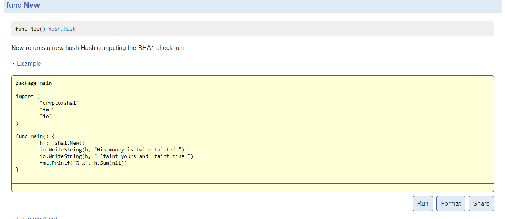

## 2.5测试

Go语言中，写单元测试函数验证程序是否能够达到实际的运行效果。编写测试代码与编写程序是有区别的，测试代码关注的是目标程序中的某一部分的处理逻辑，边界状态和处理性能。但从程序的处理过程而言，测试程序与普通的Go程序是一样的。测试程序依赖go test命令，通过这个命令和附加参数实现对测试程序的运行。

一个包目录下面，所有以_test.go为后缀的Go文件都是测试文件。go build命令会忽略所有测试文件，而go test只会运行测试文件中的函数。此外，也会出现包下面没有测试文件，而测试文件专门归属到某个测试包下。这样组织程序文件是为了分离源代码和测试代码，便于统一管理和维护。另外，这样做也可以避免循环导入包。

在测试文件中，有三种不同类型的函数，分别是测试(test)函数、基准点(benchmark)函数和实例(example)函数。测试函数以Test作为函数的前缀，验证程序逻辑是否正确。测试命令go test会运行测试函数并报告是否成功，测试模式与Java的单元测试类似。基准点函数以Benchmark作为函数的前缀，测量对一些操作的性能，测试命令go test会报告基准点函数的性能特性值和执行时间。实例函数以Example作为函数的前缀，实现检查机器的文档。测试文件中一定会导入测试包testing，下面将对这三种类型的函数做详细地介绍。

### 2.5.1测试函数

测试函数用于测试程序某部分的功能，主要针对功能性测试。测试函数的定义格式：

```
func TestName (t *testing.T) {
// ...
}
```

从定义格式可知，测试函数必须以Test开头，Name为测试函数的后缀名称，可以根据具体业务或者目标函数命名，命名的首写字母必须为大写。下面的测试函数实现了对包util中的Reverse函数进行的功能验证。 

```
func TestReverse(t *testing.T){
	s := "123456789"
	sReverse := util.Reverse(s)
	if "987654321" != sReverse {
		t.Errorf("返回字符串: %s" , sReverse)
	}
```	

测试函数的t参数提供了测试所需的必备方法，这些方法可以报告测试是否成功以及记录下额外的日志信息。从上文的代码可知，调用了util包中的Reverse()函数后，将返还的字符串赋值给变量sReverse。如果变量sReverse不是所希望的倒序字符，记录测试失败，并记录失败的信息。

进入测试方法所在的目录，执行测试命令得到对应的输出结果。

```
>go test
PASS
ok      github.com/elitecodegroovy/go-core/chart2/test  0.406s

```

上文的命令会测试这个目录下的所有测试程序。如果想指定测试函数，并且显示测试函数的名称，可以通过添加参数-run和-v实现。-run参数的值支持正则表达式，匹配目标测试函数。-v输出测试函数的名称、是否成功以及函数的执行时间。下面代码中，定义了一个新的测试函数`TestSwapCase()`。

```
func TestSwapCase(t *testing.T){
	s1 := "testSwapCase"
	s2 := util.SwapCase(s1)
	if "TESTsWAPcASE" != s2 {
		t.Errorf("返回字符串: %s" , s2)
	}

}
```

在另外的测试文件test2_test.go中，定义一个测试函数TestLongStrSwapCase()。

```
func TestLongStrSwapCase(t *testing.T){
	s0 := "wE BELIEVE IT'S WORTH TRYING AGAIN WITH A NEW LANGUAGE, " +
		"A CONCURRENT, GARBAGE-COLLECTED LANGUAGE WITH FAST COMPILATION. rEGARDING THE POINTS ABOVE"
	s1 := "We believe it's worth trying again with a new language, a concurrent, " +
		"garbage-collected language with fast compilation. Regarding the points above"
	s2 := util.SwapCase(s1)
	if s0 != s2 {
		t.Errorf("转换后的字符：%s", s2)
	}
}
```

仅执行函数名称包含字符串SwapCase的函数，可以使用下面的测试命令。从执行结果可知，测试函数名称中包含目标字符均被执行了。

```
>go test -run="SwapCase" -v
=== RUN   TestSwapCase
--- PASS: TestSwapCase (0.00s)
=== RUN   TestLongStrSwapCase
--- PASS: TestLongStrSwapCase (0.00s)
PASS
ok      github.com/elitecodegroovy/go-core/chart2/test  0.436s

```


对于多种情况的测试，可以在测试函数中构建一个数据表单。下面的代码中，通过结构对象的切片来填充不同类型的输入字符和期望字符。

```
func TestMultipleSwapCase(t *testing.T){
	var ts = []struct{
		input string
		expected string
		}{
			{"abc", "ABC"},
			{"Abc", "aBC"},
			{"abC", "ABc"},
			{"a★★", "A★★"},
			{"a好bc", "A好BC"},
			{"こんにちは,Miss Li", "こんにちは,mISS lI"},
			{"こんにちは！", "こんにちは！"},
	}
	for _, in := range ts {
		if got := util.SwapCase(in.input); in.expected != got {
			t.Errorf("expected :(%q) , real := %v", in.expected, got)
		}
	}
}

```

指定测试函数的名称，执行这个测试函数，见下面的输出结果。

```
>go test -v -run="MultipleSwapCase"
=== RUN   TestMultipleSwapCase
--- PASS: TestMultipleSwapCase (0.00s)
PASS
ok      github.com/elitecodegroovy/go-core/chart2/test  0.481s

```

有时候，为了知道程序是否均被测试函数覆盖而引入程序覆盖范围(coverage)的概念。Go提供的覆盖范围工具go tool cover能够帮助标识程序的虚弱点。一般而言，常用程序语句覆盖率检验测试代码是否完备，第十章会对测试的语句覆盖进行详细介绍。

### 2.5.2基准函数


Go测试文件中，基准函数用于测量程序的性能。基准函数的定义格式：

```
func BenchmarkName (b *testing.B) {
// ...
}

```

基准函数以Benchmark作为前缀，Name为基准函数的名称，参数类型*testing.B与测试的*testing.T一样，只是增加了对于性能的测量操作。定义了多个基准函数，运行基准函数时，参数-bench用于选择那个基准函数运行。当输入参数添加-benchmem时，基准函数的测试结果报告中会增加内存消耗和分配计数的统计记录。

写基准函数是相对比较非常容易的事情，下面就是一个简单的例子。

```
func BenchmarkSample(b *testing.B) {
    for i := 0; i < b.N; i++ {
        if x := fmt.Sprintf("%d", 42); x != "42" {
            b.Fatalf("Unexpected string: %s", x)
        }
    }
}
```


执行上面的基准函数，可以使用命令`go test -bench="Sprintf"`。输出结果：

```
goos: windows
goarch: amd64
pkg: github.com/elitecodegroovy/go-core/chart2/test/benchmark
BenchmarkSprintf-4      10000000               209 ns/op
PASS
ok      github.com/elitecodegroovy/go-core/chart2/test/benchmark        2.157s

```

在输出结果中，`BenchmarkSprintf-`加上数值为系统硬件的CPU核数。上文执行使用了4个进程，执行了10,000,000次，平均每个操作消耗209纳秒。输入命令行中添加参数-benchmem，执行结果中增加内存消耗和每个操作的分配计数的统计，见下面统计结果。如果需要强制Benchmark函数的执行结果中有这样的统计信息，只需要在函数中调用方法`b.ReportAllocs()`或者`b.SetBytes()`即可。

```
BenchmarkSprintf-4      10000000               199 ns/op              23 B/op          3 allocs/op

```

某些特定情况下，可能会预先添加一些操作，而这些操作不希望包括到Benchmark的时间消化中。这时，配合使用函数b.StartTimer()、b.StopTimer()和b.ResetTimer()实现你需要的效果。下面将验证Go字符串拼接处理的性能，通过数据比较哪种方式效率最佳。

现已知有三种方式实现字符串的拼接操作（也可以有更多方式）。第一种是使用字符串操作符+=，第二种使用函数strings.Join()，最后一种是使用bytes.Buffer机构对象。利用字符串操作符+=实现字符串拼接是最简单的方式，但是，由于Go中string类型是不可变的值，每次给一个字符串变量赋值都会重新分配地址空间。因此，频繁进行这样的操作会导致程序运行缓慢。字符串操作符+=附加操作的时间复杂度为O(N^2)。

Go标准库strings提供了Join()函数实现了字符串切片按照指定字符进行拼接操作，利用库函数可以省去字符串切片的处理工作。于是，所有的工作重点将是如何构建一个高效的字符串切片，下面就是一个典型的实现过程。

```
//定义一个字符串的函数next
//字符串切片的最大容量numConcat
next := nextNumString()
a := make([]string, 0, numConcat)
for u := 0; u < numConcat; u++ {
    // next()获取指定字符串
    a = append(a, next())
}
ns = strings.Join(a, "")

```


利用构建函数make()创建指定初始容量和最大容量的字符串切片，再通过for循环依次附加字符串，最后调用函数strings.Join()实现字符串拼接操作。库函数调用实现的字符串拼接的时间复杂度为O(N)。

Go标准库bytes提供了结构Buffer，利用bytes.Buffer实现的io.Writer可以实现对字符串的拼接操作。bytes.Buffer实现字符串的拼接操作的时间复杂度为O(N)。典型的实现过程如下。

```
//定义一个字符串的函数next
//字符串切片的最大容量numConcat
next := nextNumString()
buffer := bytes.NewBuffer(make([]byte, 0, numConcat*10))
for u := 0; u < numConcat; u++ {
// next()获取指定字符串
    buffer.WriteString(next())
}
ns = buffer.String()

```
与`String.Join() `使用方式类似，先创建一个指定初始容量和最大容量的的结构对象buffer，利用结构Buffer的方法WriteString()写入字符串数据，最后调用方法String()放回拼接成功的字符串，并赋值给ns变量。 

运行测试命令`go test -bench=.`得到的结果如下。

```
BenchmarkStrConcat10-4           2000000               620 ns/op              96 B/op         11 allocs/op
BenchmarkStrConcat100-4           200000              9785 ns/op            9984 B/op        102 allocs/op
BenchmarkStrConcat500-4            10000            152208 ns/op          346353 B/op        902 allocs/op
BenchmarkStrConcat1000-4            3000            519363 ns/op         1498550 B/op       1902 allocs/op
BenchmarkStrConcat5000-4             100          14480829 ns/op        47496886 B/op       9902 allocs/op
BenchmarkJoinSize10-4            3000000               503 ns/op             216 B/op          5 allocs/op
BenchmarkJoinSize100-4            500000              3152 ns/op            2208 B/op          6 allocs/op
BenchmarkJoinSize500-4             50000             27661 ns/op           12320 B/op        406 allocs/op
BenchmarkJoinSize1000-4            30000             59370 ns/op           25440 B/op        906 allocs/op
BenchmarkJoinSize5000-4             5000            309017 ns/op          138976 B/op       4906 allocs/op
BenchmarkBufferSize10-4          3000000               448 ns/op             264 B/op          5 allocs/op
BenchmarkBufferSize100-4          500000              2562 ns/op            1360 B/op          6 allocs/op
BenchmarkBufferSize500-4           50000             24161 ns/op            8208 B/op        406 allocs/op
BenchmarkBufferSize1000-4          30000             50969 ns/op           16336 B/op        906 allocs/op
BenchmarkBufferSize5000-4           5000            282416 ns/op           95440 B/op       4906 allocs/op

```

从上面的统计数据可知，对与极少量字符串拼接操作，使用操作符+=会比较好。如果是大量的字符串拼接操作，使用bytes.Buffer最佳。如果已经存在字符串切片，使用strings.Join()最好。如果你想分析Benchmark的内存和CPU的信息，可以附加参数-cpuprofile=cpu.out 和-memprofile=mem.out（cpu.out和mem.out为输出文件名称）。Go有一个强大的构建分析器(profiler)，它支持对CUP、内存、goroutine和程序块(block)竞争的分析(profiling)。具体有关信息，见第十章节。
 
 
### 2.5.3实例函数

实例函数作为包文档显示的Go片段代码并以测试验证输出结果。它以Example作为前缀，既没有参数也没有返回。实例函数的定义格式：

```
func ExampleName () {
// ...
//Output
}
```


实例函数比较特殊的是需要写输出结果注释，程序执行完成后会与预定义的输出结果进行对比。如果不相等，就会报错。实例函数主要达到三个目的，分别是文件、程序执行和亲自实验。文件是为了让包的阅读者能够快速掌握包的API调用方式，简洁地展示包的方法或者函数的使用场景。程序执行是执行测试命令go test，实例函数中的Go代码会被编译和执行，并且与注解的内容进行对比。这样可以详细地说明了函数如何运行，得到什么结果。亲自实验是为了让读者根据实例程序，在godoc服务器上使用Go Playground让用户编辑和运行每个实例函数，见图2-2。Go实例函数是一个了不起的方式去写和维护包文档。

图2-2 包crypto/sha1的实例函数文档




