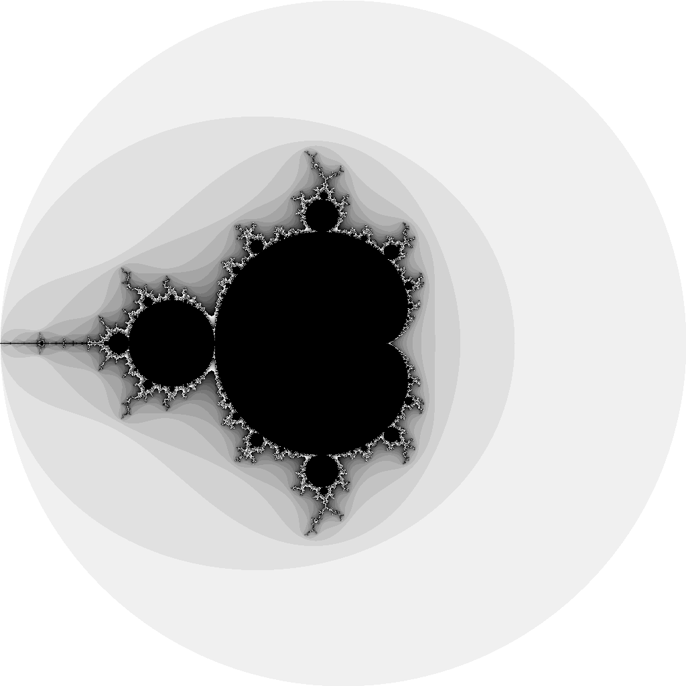

#第三章	数据类型

Go提供了许多不同类型的方式组织数据，一方面满足硬件功能的需要，另外一方面，满足程序员方便地构建复杂的数据结构和算法。

Go的类型可以划分为2大类：基本类型和组合类型。基本类型包括数字、字符串和布尔，组合类型主要指数组、切片（slice）、map、指针(pointer)、函数、接口(interface)、结构(struct)和管道（channel）。这一章节将对数据类型作详细描述。

## 3.1基本类型

基本类型是程序中最常见一类数据类型，是构建函数、包的基本组成部分。下面将一一介绍数据类型的基本操作。

### 3.1.1数值

Go的数值数据类型主要包括整型、浮点型和复数。整型中分为符号整型和无符号整型，符合整型以int8、int16、int32和int64表示，与之相对应的无符号整型有uint8、 uint16、 uint32和uint64。对于不同的平台，Go提供了无符号int和符号uint，编译器会根据硬件类型编译成32位或者64位的数值大小。因此，实际编程过程中，uint常用于按位操作或者算术运算，比如分析二进制文件格式、哈希编码以及密码系统。与之相对应，int 常用于函数返回的整型类型，比如构建函数len()、cap()等都是int返回类型。

算术和逻辑运算必须是相同类型的操作数，偶尔需要注意同类型数值相乘操出本类型数据大小的情况。下面的代码片段需要转化操作数为相同类型方能解决编译出错。

```
var i int32 = 1
var j int16 = 2
//var x int = j + i // 编译出错，类型不同
fmt.Println("i:", i, ", j:", j)
```

转化操作T(x)就是将x的值转化为T类型的值，比如将大的整型类型转化小的整型类型，浮点型转化成整型类型。反过来也是一样地，但是，可能会改变数值或者精确度。

浮点型转化成整型会丢弃小数点部分的数据，在实际编程中需要避免操作数转化后的数超出了目标类型的数值范围。见下面代码实例。

```
f1 := 2.15 // 浮点数
i1 := int(f1)
fmt.Println(f1, " ", i1) // "2.15 3"
f1 = 9.99
fmt.Println(int(f1)) // "9"
```

当使用fmt包打印对应的数值时，需要控制好基值和数据的格式。对于函数Printf()的格式(verbs)，可以查阅附录A。下面的代码中，声明了八进制类型o和int64类型的x，分别按照指定格式输出。Printf的格式%加上指定的标识，输出指定格式的数值。代码中，%d表示按照十进制输出，%[1]o表示按照八进制数值输出，%#[1]o表示按照八进制且带符号的输出。与此类比就容易理解y的输出格式了。

```
o := 0777
fmt.Printf("%d %[1]o %#[1]o\n", o)       // "511 777 0777"
y := int64(0xbadbed)
fmt.Printf("%d %[1]x %#[1]x %#[1]X\n", y)//12245997 badbed 0xbadbed 0XBADBED

```


字符类型（rune type）的数据大小与int32一样，并且数据是Unicode编码（与C语言中char类型类似）。表示方式为单引号加一个字符标识，例如'x' 和'\n'。与此类似，字节类型（byte type）的数据大小与uint8一样，也称其为uint8的别名。表3-1展示了整型的取值范围。

表3-1 整型的取值范围

数据类型|	范 围
---    | --- 
byte   |	-128~127
int8   |	-128~127
uint8  |	0~225
int16  |	-32768 ~ 32767
uint16 |	0~65535
int32  |	-2147483648 ~2147483647
uint32 |	0~4294967295
int64  |	9223372036854775808 ~ 9223372036854775807
uint64 |	0~18446744073709551615

Go提供了一个无符号整型类型uintptr，它的数据大小与uint一样。这个数据类型仅仅使用在Go与C语言库的操作边界，属于底层编程。鉴于这个数据类型使用范围不广，这里仅作简要描述。

Go提供了与C、C++和Java语言一样运算符，用于数值的算术、逻辑和比较操作。在表3-2中，列举了常见的运算符和对应的功能描述。

表3-2 数值运算符

运算符       |	范 围
---         | --- 
*           |	乘法运算符
/           |	除法运算符
%           |	余数运算
<<          |	数值位移，向左移，如1 << 8表示将1二进制位左移8位的值
>>          |	数值位移，向右移，如2 >> 1表示将2二进制位右移1位的值 
&           |	二进制位与操作
&^          |	二进制位与非操作
+           |	加法运算符
-           |	加法减法
|           |	二进制位或操作
^           |	二进制位非操作
==          |	判断符号，两个值相等是否为真
!=          |	判断符号，两个值不相等是否位真
<           |	判断符号，两个值小于是否为真
<=          |	判断符号，两个值不大于是否位真
>           |	判断符号，两个值大于是否为真
>=          |	判断符号，两个值不小于是否位真
&&          |	判断符号，两个表达式同为真才是true，否则，为false
&#124;&#124;|	判断符号，两个表达式任意一个为真才是true，否则，为false


浮点型包括float32和float64，分别有32位浮点数和64位浮点数，IEEE-754标准规定浮点型的计算属性。一个float32提供接近6个小数位的精确度，而float64则提供了15位的精确。最小的正整数是无法展现的，下面的代码片段说明了这一点。

// 1 << 24
var f2 float32 = 16777216 
//f2:  1.6777216e+07 , f2 + 1= 1.6777216e+07
fmt.Println("f2: ", f2, ", f2 + 1=", f2+1)
// "f2 == f2+1 : true"
fmt.Println("f2 == f2+1 :", f2 == f2+1)


浮点型的极值常量可以查看math包，另外，math还声明了整型的不同位数的极值常量。

Go提供了两个大小复数类型，64为的complex64和128位的complex128，对应的组成部分分别是float32和float64。构建函数complex从实数和虚数部分创建一个复数，利用构建函数real和imag抓取对应的实数和虚数。

```
var x complex64 = complex(2, 3) // 2+3i
var y complex64 = complex(1, 9) // 1+9i
fmt.Println(x*y) // "(-25+21i)"
fmt.Println(real(x*y)) // "-25"
fmt.Println(imag(x*y)) // "21"

```


复数的声明也可以直接使用实数加虚数的方式，如下面的代码片段。

```
a := 1 + i
b := 2 + 2i
```

两个复数进行算术运算，起结果依然是复数。

```
fmt.Println(12i * 10i) // "(-120+0i)"

```


Go的包math/cmplx提供了对于复数的基本操作，如开平方根、e的指数计算等，代码片段如下。

```
fmt.Println(cmplx.Sqrt(-1)) //复数-1的开方根： "(0+1i)"
fmt.Println(cmplx.Exp(2))  //e的2次方："(7.38905609893065+0i)"

```


利用复数实现曼德布洛特(Mandelbrot)集合的实例，可以查看本章节的源代码。实例中输出曼德布洛特集合的输出图片，见图3-2曼德布洛特集合。
	




图3-3曼德布洛特集合
### 3.1.2字符串


一个字符串就是一个不可变的字节序列。字符串有两种表达方式，一种是原生态的字符，另一种是解释性的字符。原生态字符用命令符合``表示，无转义字符处理，例如`raw string literals`。因此，原生字符常用在HTML模板、JSON字符、命令行消息等场景。解释性的字符用双引号“”表示，例如“intepreted string literals”，常用于一般性字符串声明。字符串的表达形式：

```
s1 := `abc`                // 相同于 "abc"
s2 := `\n
\n`                  // 相同于 "\\n\n\\n"
s3 :="\n"
s4 :="\""                 // 相同于 `"`
s5 := "Hello, world!\n"
s6 :="粤語"
s7 :="\u65e5本\U00008a9e"
s8 :="\xff\u00FF"
//var s9 = "\uD800"     //不合法:转义字符串不是有效的Unicode编码点
//s10 :="\U00110000"         // 不合法：无效的Unicode编码点
```

上面集中描述了字符串的表达方式。 

截取字符串可以直接使用下标索引，下标索引从0开始，直到字符串长度len(str)-1为止。如果超出了字符串的长度，就会抛出panic错误而导致程序终止运行。代码片段如下： 

```
s := "Welcome golang programmer! "
fmt.Println("字符串长度：", len(s))
//c := s[len(s)]  //超出区间的边界
s1 := s[0:7]
fmt.Println("s1: ", s1)
```

字符串变量的下标可以省略。默认情况下，开头为0，末尾为len(str)-1。代码片段如下：

```
fmt.Println(s[:]) // "Welcome golang programmer!"
fmt.Println(s[:7]) // "Welcome"
fmt.Println(s[8:]) // "golang programmer!"

```


Go的字符串变量或者常量可以直接进行等于号(==)、 大于号(>)、小于号(<)等运算符操作。

```
fmt.Println("s > s1:", s > s1)  //s > s1: true
```


运算符+可以拼接两个字符串形成一个新的字符串，运算符+=可以将原来的字符串上添加新的字符串。字符串变量t依然保存的是s2的旧值，s2通过运算符+=操作后，其值已经变成新的字符串。字符串的值是不可改变的，不意味着不可以在原来的字符串上添加新字符串，然后再赋值给这个字符串变量。

```
s2 := "prefix string"
t := s2
s2 += ", suffix string"
fmt.Println("t :", t)//t : prefix string
fmt.Println("s2:", s2)//s2: prefix string, suffix string

```


可以添加新的字符串，但是，不允许修改字符串。

```
//s2[0] = 'P'             //编译出错,无法给s[0]赋值

```

在Go的术语中，使用单引号的字符称为单一字符（a rune），在其他编程语言中（如C、C++）称为Unicode编码点(Unicode code point)，比如’ `\U00004e16`’等。单一字符变量与int32类型的变量所占用的存储空间是一样的，都是32位。

在单一字符中，Unicode转义可能被使用。下面三个单一字符是等同的，接下来将介绍Go的字符串编码。
'`世`' '`\u4e16`' '\`U00004e16`'


Go源代码文件总是采用UTF-8编码，这个变量长度编码属于Unicode编码中的一种，也是比较常见的编码类型。unicode包提供了对单一字符有关的处理函数，包unicode/utf8用UTF-8编码对单一字符进行有关的编码和解码操作。编程的时候，时常会关心字符串在内存中的展示方式。下面的实例中，字符串占用12个字节的存储空间，单一字符有8个。可以进一步理解为：字符串“great ”中各个字符占用一个字节，两个简体汉子“中国”各占用3个字节。每个字符就是一个单一字符。

```
s3 := "great 世界"
fmt.Println(len(s3)) // "12"
fmt.Println(utf8.RuneCountInString(s3)) // "8"

```

将数值转化为单一字符，代码片段如下：

```
fmt.Println(string(65)) // "A"，65对应的编码字符
fmt.Println(string(0x4eac)) // "京"
如果数值没有对应的单一字符（无效单一字符），程序会取而代之用乱码标识输出。
fmt.Println(string(1234567)) // "�"
```


### 3.1.3布尔


布尔类型只有两个值的结果值是true或者false，常用于if、for和操作符的判断语句中。操作符&&(AND) 和|| (OR) 能够结合布尔操作，并且可以连接多个布尔值。实例代码如下： 

```
if c > 0 && c < 100 || n >1000 && n < 10000 {
    // 0<c<100 OR 1000<c<10000 情况下的语句
}

```
