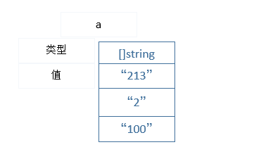

## 3.2组合类型

组合类型主要包括数组、切片、map、指针、函数、接口、结构和管道。数组和结构也可以称为聚合类型，数组是同类型—元素的值是用一个类型，而结构是由不同成分组成—元素类型可以多种多样的。数组和结构是固定大小，相比而言，切片和map是动态数据结构，能够随着数据的增加而发生变化。

### 3.2.1数组

数组(Array)类型是一种常见的数据结构。由于数组的长度是固定的，Go中很少直接使用数组。相对于数组，切片以其长度可变而被经常使用。为了更好的理解切片，必须先理解数组。

数组可以通过下标直接访问数值中的元素，下标从0开始到数组的长度值len()-1为止。可以利用构建函数len()获取其长度，代码片段如下：

```
var x [5]int             // 声明一个包含5个元素的数值
fmt.Println(x[0])        // 输出数组x[0]的值
fmt.Println(x[len(x)-1]) // 输出数组最后一个元素的值

// 遍历数值中的各个元素值，包括数组的索引号
for i, v := range x {
    fmt.Printf("x[%d]:%d\t", i, v)
}
fmt.Println("\n --------------------")
// 仅遍历数组的各个元素值，忽略数值的索引号
for _, v := range x {
    fmt.Printf("%d\t", v)
}
```


默认情况下，数值数组的初始化都是0值。另外一种数值声明方式就是直接使用一些值初始化数组。注意：初始化的个数不能够超过数值声明的大小。

```
var a [5]int = [5]int{0, 1, 2, 3, 4}
var b [3]int = [3]int{1, 2}
fmt.Println("\n", b[2])       // "0"
fmt.Printf("a[5]:%v", a)      //输出数组a

```


数组的声明过程中，有时候可以使用省略号“…”取代具体数值长度值。省略号代表的数值大小由初始数值的长度决定。

```
c := [...]int{0, 1, 2, 3}
fmt.Printf("%T\n", c) // "[4]int"
```


数组的声明也可以指定索引号，下面是代码片段。声明了第100个元素的值为-1，同时也意味着，第100个元素前面的元素值都为0。

```
iv := [...]int{99: -1}   //声明第100个元素为-1
```


数组的长度是这个类型的一部分，如果数值的长度不一样，那么这样的数组不具有可比较性。例如，[2]int和[3]int是属于两个不同类型的数组，这两个数组就不能够进行比较。只要数组元素具有可比较性，那么这样的数组也具有可比较性。

```
d1 := [2]int{1, 2}
d2 := [...]int{1, 2}
d3 := [2]int{1, 3}
fmt.Println(d1 == d2, d1 == d3, d2 == d3) // "true false false"
d := [3]int{1, 2}
//fmt.Println(a == d) //编译出错，无法比较[2]int 和 [3]int

```

在Go语言中，当一个函数被调用时，每个参数值将会被复制一份，并且被赋值给对应的参数变量，函数因而接受一份复制的参数值而不是原生态的。如果将大的数组传递给被调用函数，复制参数的过程将导致程序运行效率不高。因为是值的传递，被调用函数对数组的变更操作不会影响到原来的数组。为了避免这种情况，大多数实际编程过程中，采用切片作为参数进行函数参数的传递。

### 3.2.2切片

切片(Slice)类型属于Go语言独有的一种数据结构。一个切片有三个组成成分—一个指针、一个数组长度和一个数组容量。切片的指针指向数组的一个元素，数组的长度是有数组的元素个数决定的，它不能够超过数组的容量。构建函数len和cap可以获取对应的切片长度和容量。

如果切片是利用存在的数组创建的，那么，切片和这个存在的数组共享部分数组区间。下面的代码中，使用存在的d5数组初始化切片s1。当修改d5中的第三个元素后，切片对应的元素也随着改变。

```
d5 := [8]int{0, 1, 2, 3, 4, 5, 6, 7}
s1 := d5[2:]
//数组和切片共享｛2, 3, 4, 5, 6, 7｝
fmt.Println("before d5:", d5, ", slice s1:", s1)  
d5[2] = 10
//修改数组的值，切片的元素也将会改变，因为它们同享相同的数组区间
fmt.Println("after d5:", d5, ", slice s1:", s1)  

```

定义一个倒序函数，实现将数组元素的倒序。


```
//inverse int array
func reverseInt(a []int) {
    for i, j := 0, len(a)-1; i < j; i, j = i+1, j-1 {
        a[i], a[j] = a[j], a[i]
    }
}

```

切片是指针的别名传递，数组是值传递。下面代码中，创建了一个数组a1，利用存在的数值a1创建一个切片，并且作为参数传递给函数reverseInt。函数修改了切片的值，由于其共享同一个数组空间，数组的值也随之发生改变。

```
a1 := [...]int{10,9,8,7,6,5}
reverseInt(a1[:])
fmt.Println(a1) // "[5 6 7 8 9 10]"

```

下面代码中，表达式初始化切片与数组表达式的初始化是有差异的，切片没有指定对应的数值长度。因此，经过倒序函数reverseInt后，数组中的元素发生改变。按照这样的方式声明的切片可以用[]int类型来表示。

```
s2 := []int{10,9,8,7,6,5}
reverseInt(s2)
fmt.Println(s2) // "[5 6 7 8 9 10]"
fmt.Println("len:" ,  len(s2), ", cap:", cap(s2)) // "len: 6 , cap: 6"
fmt.Printf("%T",  s2) // "[]int"
```


切片是不可比较的，也就是说，不能够使用操作符==判断两个切片中的元素是否相等。切片唯一合法的比较操作是判断slice是否为nil。

```
if s2 == nil { /* ... */ }
```


如果len(s2)为0，并不意味着s2就是nil。构建函数make创建切片时，可以指定切片的元素类型、初始化的切片长度和切片容量。声明表达：

```
make([]T, len)
make([]T, len, cap) // same as make([]T, cap)[:len]
```


本质上讲，切片好比C语言中声明一个指向数组的指针以及数组的大小和容量的结构。

构建函数append可以向切片中添加一个或者多个元素。代码片段如下：

```
var x1 []int
x1 = append(x1, 11)
x1 = append(x1, 12, 13)
x1 = append(x1, 14, 15, 16)
x1 = append(x1, x1...) // append the slice x1
fmt.Println(x1) // "[]int[11 12 13 14 15 16 11 12 13 14 15 16]"

```

在实际的编程过程中，切片共享数组的概念常常会被使用到。下面的代码片段中，输入切片，返回去除了空字符的切片本身。这样操作就可以避免分配另外一个数组，提高了程序的运行效率。

```
func rmEmpty(str []string) []string{
    i := 0
    for _, s := range str {
        if s != "" {
            str[i] = s
            i++
        }
    }
    return str[:i]
}
```


使用下面的测试切片检测程序的运行结果。由于切片内部的数值是共享的，任何对共享数组的修改都会立刻生效。

```
langs := []string{"C", "", "C++", "Golang"}
fmt.Printf("%q\n", rmEmpty(langs)) // `["C" "C++" "Golang"]`
fmt.Printf("%q\n", langs)          // `["C" "C++" "Golang" "Golang"]

```

大多数情况下，程序都会这样写langs = rmEmpty(langs)。利用构建函数append可以改造一下rmEmpty函数，代码片段如下： 

```
func rmEmpty2(str []string) []string{
    result := str[:0]
    for _, s := range str {
        if s != "" {
            result = append(result, s)
        }
    }
    return result
}

```

利用切片的这一特性，可以用切片进行栈的添加和删除操作。

```
stack := []string{}
s1 := "BENZ"
//元素s1进栈
stack = append(stack, s1)
fmt.Printf("stack: %v \n", stack )
s2 := "tesla model 3"
stack = append(stack, s2)
//栈的最后一个元素出栈
x := stack[len(stack) -1]
fmt.Println("x :" , x)

// 去除最后一个元素后的stack
stack = stack[:len(stack)-1]
fmt.Printf("stack[len-1] : %v" , stack)

```
从切片中删除一个元素，代码片段如下：


```
func Doslice(){
    fmt.Println()
    s := []string{"one", "two", "three", "four"}
    fmt.Println(rmStr(s, 2)) //删除第二个元素后的切片： [one two four]
}

func rmStr(slice []string, i int)[]string{
    copy(slice[i:], slice[i+1:])
    return slice[:len(slice)-1]
}

```


### 3.2.3字典（map）


Go的map是一个哈希表的引用，map对应的就是一个键值对的集合。在一个map中，声明了独立无二的关键字，并且与之相关联的值。构建函数make可用用来创建map实例变量，下面是创建了一个int类型的关键字，值为字符串的map变量a，并且分别给关键字1和2声明对应的值。最好，输出a的值。

```
a := make(map[int]string)
a[1] = "张三"
a[2] = "李四"
fmt.Printf("map a : %v", a)// map a : map[2:李四 1:张三]
```

也可以直接指定键值对初始化一个map对应，下面的代码中以初始化的键值对创建map变量b，输出b的值。

```
b := map[int]string {
    3:"张瑞",
    4:"李明",
}
fmt.Printf("\nmap b:%v", b) //map b:map[3:张瑞 4:李明]

```


map可以使用下标识关键字直接获取对应的值：

```
fmt.Printf("\nmap b[3]:%s", b[3]) //map b[3]:张瑞

```

使用map的test表达式会返回两个值，第一个返回值就是关键字对应的值（如果map不存在该关键字，那么就是值类型的0值），第二个返回布尔类型的值，报告关键字是否存在于map中。可以通过第二个返回值确定map中是否存在这个关键字的键值对。

```
if name, ok := b[3]; ok {
    fmt.Println("name :", name)
}

```

上面代码中，如果存在关键字为3的值，输出对应的name值。

删除map中一个元素，直接使用构建函数delete。即使关键字不存在于map中，这样的删除操作也是安全的。代码片段如下：

```
//delete one element
delete(b, 3)  //存在关键字
delete(b, 2)  //不存在关键字

fmt.Printf("\nmap b:%v", b)// map b:map[4:李明]

```

连续迭代输出map中的所有键值对，和切片一样都可以使用基于range循环遍历。下面的代码片段循环输出了map中的键值对，这样的循环无法保证每次都得到相同的结果。

```
fruit := map[string]int {
    "apple":10,
    "orange":2,
    "banana":100,
    "grape":300,
}
fruit["peach"] = 10
fruit["litchi"] = 200
for k, v := range fruit {
    fmt.Printf(" %s, quanity: %d\n", k, v)
}

```

为了有序输出map中的键值对，可以先将关键字排序，然后依次获取对应的值。代码片段如下：

```
var keys []string
for k, _ := range fruit {
    keys = append(keys, k)
}
//排序keys
sort.Strings(keys)
for i:=0 ; i < len(keys); i++ {
    fmt.Printf(" %s, quanity: %d\n", keys[i], fruit[keys[i]])
}
```


map类型的0值是nil，也就是说，map的引用没有指定向任何哈希表。

```
var authors map[string]string
fmt.Println("init map :", authors == nil, ", map size 0: ", len(authors) == 0)

```

如果这样的map进行任何操作（获取某个值或者delete或者len），那么就会报编译错误。因此，必选先指定map的哈希表后才能够存储数据。

```
authors["John.Lau"] = "Go核心技术编程"//panic:无法赋值给nil map变量
```

map与切片一样，无法直接比较两个变量是否相等。如果需要比较两个map是否相等，需要写自定义的函数进行数值比较。比如比较map[string]int类型的两个map，可以参考下面的代码。

```
func compareInt(x, y map[string]int) bool{
    if len(x) != len(y) {
        return false
    }
    for k, xv := range x {
        if yv, ok := y[k]; !ok || yv != xv {
            return false
        }
    }
    return true
}

```

### 3.2.4指针

2.2.3节已经介绍过指针的基本语法，本小节将对指针作进一步深入探究。指针的星号(*)表示指针指向的地址空间的存储数据。下面，指针p指向i的存储地址，fmt函数输出指针p存储地址上的值。

```
i := 100
p := &i
fmt.Println("*p :", *p)   //输出指针p的值

```

指向结构的指针称为结构指针，常用来对结构的字段或者函数直接访问。下面的代码中，声明了一个有两个字段属性的结构person。初始化一个结构变量p，使用指针pp指向这个结构变量p，利用指针可以直接访问结构中的属性字段。

```
type person struct {
    name string
    age int
}

func doPointer(){
    p := person{name: "李明", age: 20}
    fmt.Printf("姓名：%s, 年龄：%d", p.name, p.age)

    pp := &p
    fmt.Printf("\n姓名：%s, 年龄：%d", pp.name, pp.age )
}

```

与C语言不同的是Go不支持指针的算术运算，下面的代码片段会抛出编译出错。p指针无法进行算术的++操作，Go语言不支持。

```
b := [...]int{109, 110, 111}
p := &b
p++//编译出错
fmt.Println("p:", *p)

```

### 3.2.5函数


2.2.5节对函数的基本语法有一定介绍，本节将对函数进行深入探究。函数是任何编程语言至关重要的一部分，它承载着实现各个任务的基本单元。函数的表达式：

```
func name (parameter ) ( result) {
body
}

```

包级别的函数定义必须指定函数的名称name，可选择地声明函数参数列表parameter以及返回值列表result。函数闭包体内body声明一系列的语句，实现逻辑操作。函数可以返回多个值，也可以在返回值的括号里面指定返回类型的变量。下面的代码实现两个float64作为函数的参数，返回经过计算的平方根。

```
func sqrtFloat(x, y float64) float64{
    return math.Sqrt(x*x + y*y)
}
```


测试上面定义的函数，直接调用函数。

```
fmt.Println("3*3+4*4的平方根：", sqrtFloat(3.0, 4.0))// 3*3+4*4的平方根： 5

```


查看标准库的源码，你会发现有些函数没有实现语句。这是因为函数已经用汇编语言实现了，在标准库中，只需要定义函数标记。

```
package math

func Sqrt(x float64) float64

```

前面章节中，对函数的已经有了基本认识，本章节将深入探究函数的递归、匿名和异常处理。

> 递归函数

递归函数本质上是处理递归的数据结构，对于解决实际问题，递归函数发挥着重要的作用。例如，已经介绍过得斐波纳契函数就是利用递归实现的斐波纳契数列。下面阶乘函数，利用递归函数简单地实现了数的阶乘运算。

```
func factorial(x uint) uint { //recursion
    if x == 0 {
        return 1
    }
    return x * factorial(x-1)
}

func doRecursion(){
    fmt.Println("8的阶乘：" , factorial(8)) // 8的阶乘： 40320
}

```

> 函数值

在Go语言中，函数是第一等值。函数值有类型，它能够赋值给指定的变量、传递给函数和从函数返回。下面实例代码中，定义函数increase()和decrease()两个函数。利用函数值的特性，分别调用函数值变量incr和decr，输出对应的值。

```
func increase(n int) int{
    n++
    return n
}

func decrease(n int) int {
    n--
    return n
}

func doFuncValue(){
    incr := increase
    decr := decrease
    fmt.Printf("incr(5): %d, 函数类型:%T \n", incr(5), incr)
    fmt.Printf("incr(5): %d, 函数类型:%T \n", incr(10), incr)
    fmt.Printf("decr(10): %d, 函数类型:%T \n",  decr(10),  decr)
}

```


> 匿名函数

匿名函数常常作为函数类型、函数值和函数闭包来使用。下面就是一个作为函数闭包的实例。在power()函数内部定义了一个匿名函数，以匿名函数值返回，利用匿名函数的特性可以计算基于power()传入参数的幂值。

```
func power(a int) func(int) int {
    return func(b int) int{
        return int(math.Pow(float64(a), float64(b)))
    }
}

func doAnonymous(){
    var pow2 = power(2)
    fmt.Printf("2 ^ 10 = %d\n", pow2(10))
    var pow3 = power(5)
    fmt.Printf("5 ^2 = %d\n", pow3(2))
}
```

Go语言允许匿名函数作为其他函数的参数，见下面的代码片段。匿名函数作为anon的函数anotherFunc参数。在函数anotherFunc中，初始化函数f，输出对应字符串。

```
func doAnonymous1(){
    anon := func(_name string) string {
        return "Welcome, " + _name
    }
    anotherFunc(anon)
}

func anotherFunc(f func(string) string) {
    result := f("John")
    fmt.Println(result) //"Welcome, John"
}

```


匿名函数也可以作为函数的第二个参数，标准库sort包中search函数的第二个参数就是一个匿名函数。下面的代码中查询有序数组大于7的最小索引值和对应值。

```
func doAnonymous2(){
    numbers := []int{10, 1, -5, 22, 2, 0, 1}
    sort.Ints(numbers)
    fmt.Println("Sorted:", numbers)

    index := sort.Search(len(numbers), func(i int) bool {
        return numbers[i] >= 7
    })
    fmt.Println("The first number >= 7 is at index:", index)
    fmt.Println("The first number >= 7 is:", numbers[index])
}

```


### 3.2.6接口

接口(interface)类型就是一种抽象化、泛化的类型。可以声明一个变量的类型为接口类型，然后指定拥有接口所有方法集的具体类型。

前面介绍的都是具体的类型，具体的类型可以很明确地知道“是什么”和“能够做什么”。接口没有显露出它的值的表现形式或者内在结构或者它所支持的基本操作集合，它仅展现出一些方法名称。当声明为接口类型时，只能够知道它的方法集合，无法确定它是什么。

如果一个类型拥有接口类型的所有方法，那么，我们称这个类型满足这个接口类型。接口为空的方法集合，任何值都可以用来作为接口的值。

```
var a interface{} = []string{"213", "2", "100"}
fmt.Printf("a type: %T, value::%v", a,  a)

```

上面代码中声明了a的接口类型，使用切片string初始化a。变量a就成为string类型的切片，值为["213", "2", "100"]，见图3-1。



图3-1 变量a的切片形式

接口值是可以进行比较操作（==或者!=）。如果两个接口值相等，说明这两个接口同为nil或者它们的动态类型标识和动态的值是完全相等的。但是，两个接口能否进行比较取决于接口的动态类型，比如上文中的变量a是切片类型，无法进行fmt.Println(a == a)操作，运行时会报panic错误。

如果一个类型满足多个接口类型，那么，这样的类型可以通过类型断言、类型转换等方式访问接口。通过泛化的接口类型，接口可以让程序员更加灵活地调用方法。有关接口的更多介绍，可以查阅4.1节。

### 3.2.7结构

Go的机构体与C语言的结构比较接近，从语言设计角度来讲，Go借鉴C语言的结构设计思想，它们都极好地支持结构嵌入。结构中的变量称为字段，可以在结构中声明多个类型不同或者相同的字段，这些字段也可以是另外一个结构。结构中的字段可以用点号(.)选择操作符进行访问，这样的访问策略必然要求字段名称必须唯一。

下面将介绍一个结构嵌入定义的实例，比较匿名嵌入和指定字段名称的机构体的区别。

```
package main

import (
    "time"
    "fmt"
)

type Book struct {
    Id              int64
    Name             string           //书名
    Authors         []string          //作者
    ISBN            string            //ISBN标记
}

type PublishedBook1 struct {
    Id              int64
    PublishedTime     time.Time    //出版时间
    Name             string        //出版者的名称
    book             Book
}

type PublishedBook2 struct {
    Id              int64
    PublishedTime     time.Time    //出版时间
    Name             string        //出版者的名称
    Book
}

func (pub1 *PublishedBook1) String() string{
    t1 := pub1.PublishedTime.Format("2006-01-02 15:04:05.000")
    return "PublishedTime:" + t1 + ", Name: "+ pub1.Name + ", book Name"+ pub1.book.Name +", "+", book ISBN:"+ pub1.book.ISBN
}

func (pub2 *PublishedBook2) String() string{
    t1 := pub2.PublishedTime.Format("2006-01-02 15:04:05.000")
    return "PublishedTime:" + t1 +", Name:" + pub2.Name +  ", book Name"+ pub2.Book.Name +", "+", book ISBN:"+pub2.ISBN
}

func execStruct(){
    form := "2006-01-02 15:04:05"
    timeStr := "2017-12-12 19:04:05"
    t , err := time.Parse(form, timeStr)
    if err != nil {
        fmt.Println("parsing time error", err)
    }
    pBook1 := PublishedBook1{Name: "人人出版社1",
                             book:Book{Name:"Go网络编程",
                                       Authors: []string{"John.Lau", "John"},
                                       ISBN:"16334300730000"},
                            PublishedTime:t,
            }
    fmt.Printf("publishedBook1: %+v \n", pBook1)

    pBook2 := PublishedBook2{100,t, "人人出版社2",
                            Book{1,"Go网络编程",
                            []string{"John.Lau", "John"},
                            "16334300730001"},
                            }
    fmt.Printf("publishedBook2: %+v \n", pBook2)
}

func main(){
    execStruct()
}


```


在上文的代码中，程序声明了结构PublishedBook1和PublishedBook2，并且它们都嵌入的结构Book。PublishedBook1使用字段名称的结构，而PublishedBook2使用匿名结构嵌入。另外，它们都声明了日期类型的字段publishedTime和标识Id。为了个性化地输出结构，程序中分别声明了结构PublishedBook1和PublishedBook2的String()方法， 调用fmt.Printf()方法就能够按照指定的格式输出结构(结构满足接口Stringer的String()方法)。在String()方法中，结构的字段可以直接通过点号直接访问。当结构中的字段与匿名结构中的字段重复时，访问匿名结构中的重复字段需要指定结构类型，比如代码中的pub2.Book.Name就指定了Book结构；匿名结构中的字段可以直接属于被嵌入的结构，即可以直接访问匿名字段，比如代码中的pub2.ISBN 就是直接访问Book中的字段ISBN。

结构初始化可以采用两种方式，一种是直接指定字段进行初始化，另外种是根据结构声明字段的顺序进行初始化。对应不同应用场景，可以使用不同的方式进行结构变量的初始化。一般而言，对应仅初始化部分字段的结构可以使用第一种方式，而对于初始所有字段的结构，可以使用第二种方式。

对于嵌入结构的方法调用规则和字段访问差不多，只是嵌入结构只能够访问自己定义的字段。

### 3.2.8管道

goroutine 在相同的地址空间中运行，因此，必须同步对共享内存的访问。Go语言提供了一个很好的通信机制--管道(channel)，以满足goroutine之间数据通信。管道与Unix shell 中的双向管道有些类似：可以通过它发送或者接收数据。每个管道可以承载具体类型的数据，这种数据称为管道元素类型。

管道主要有两个主要的操作：发送和接受，通俗地称之为通信。发送和接受数据是通过操作符<-实现，下面包括了有关管道常见的发送和接受数据的场景。

```
    ch := make(chan string)
    ch <- "ch1"             //发送表达式
    //....
    //另外的 goroutine
    c := <- ch             //接受表达式
    fmt.Printf("received c :%s", c)
    ch <- "another ch2"

    <-ch                  //接受表达式，抛弃接受的数据
```

管道支持第三种操作--关闭(close)管道。关闭管道的操作会设置一个标识给被关闭的管道，而这个标识表示不会有数据发送到这个管道。接受者继续接受已经发送到这个管道里面的数据，直到管道中没有任何数据可以被接受为止。关闭管道，可以使用构建函数close()。

```
close(ch)                  //关闭管道ch
```


如果向已经关闭的管道中发送数据，会抛出panic错误。管道可以是缓存和非缓存的，不指定管道容量的情况下，创建的管道是非缓存的。指定了管道的容量，并且容量大于0时，这样创建的管道是缓存的管道。

```
ch1 := make(chan int)                         // 非缓存管道
ch2 := make(chan int, 0)                      // 非缓存管道
ch3 := make(chan int, 3)                      // 容量为3的缓存管道
```

更多有关管道的介绍，可以查看第六章节。


