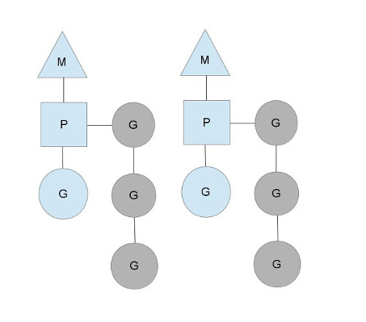
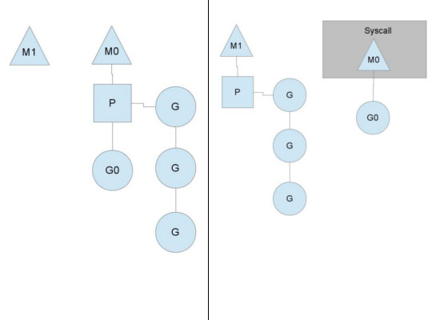

# 第五章 并发编程

并发编程是Go语言的核心之一，也是Go语言区别与其它编程语言的优势所在。支付并发的语言特性已经被构建到Go语言本身，从工程应用角度而言，Go语言就是为并发而生。

在Go语言中，并发是指多个函数彼此独立运行的能力。当创建一个goroutine时，这个goroutine将作为独立的运行单元获得调度运行，而调度是有Go语言的调度器负责的。Go的调度器是位于操作系统之上的绑定线程，统管所有创建的goroutine。在给定的时间内，调度器控制着那些运行在逻辑处理器上的所有goroutine。

Go并发同步源自于被称为通信顺序进程(communicating sequential processes, 简称CSP)的范式。CSP是一种消息传递模型，Go利用这种模型让goroutine线程之间直接进行数据通信。支持不同数据类型的同步和数据传递的通道被称为管道(channel)，管道在Go语言编程中充当信息传递的媒介，特别是不同goroutine直接数据的通信。使用管道可以很容易地编写并发程序，并且出现异常的情况极低。

并发不是并行，尽管并发能够并行运行。如果你的计算机是单核CPU，你的程序可以并发运行，但是无法实现并行运行。只有在多核CPU上，你的程序才可能以高效的并行运行.

## 5.1设计原理

### 5.1.1调度器

Go1.1之后引入了调度器(scheduler)的关键概念，谷歌工程师Dmitry Vyukov贡献了核心代码。Go调度器完成调度任务需要用到了3个主体，它们分别是M、G和P。

M：machine，表现形式为一个操作系统线程(OS Thread)。它就是操作系统所管理的执行线程，非常像标准的POSIX 线程。
P：processor，表现形式为一个调度上下文。它可以使用M:N调度器模式进行运行。
G：goroutine，表现形式为一个Go的路由。它包含调度路由所需要的栈、指令指针和一些重要信息，它可能阻塞于任何管道上一样。

用三角形表示machine，用圆形表示goroutine，用矩形表示processor。下面假设有2个操作系统物理线程M，每个物理线程下有一个调度上下文P，也都有一个正在运行的G。为了运行goroutine，调度上下文必须在物理线程上进行，见图5-1。图中灰色的那些G并没有运行，而是处于就绪态，正在等待被调度。每个P来维护着一个运行队列(runqueue)。 有关M-P-G模型的结构，可以查看Go运行库(src/runtime)源码。

调度上下文的个数由程序的GOMAXPROCS值决定，默认情况为CPU的核数，也可以在程序中限定所需的CPU核数。比如，8核CPU可以最多有8个调度上下文P。只要上下文上有G(goroutine)运行，调度器就能够以稳定的状态进行调度。你可能会问：为什么一定要调度上下文P，将运行队里直接地放到物理线程不就完事了吗？事实上不是这样的，使用调度上下文的原因是便于传递G到其他的物理线程上。比如下面的这个例子，假设我们需要阻塞，此时引出系统调用syscall。既然一个物理线程无法实现继续执行代码同时也保存syscall阻塞，这个时候就需要传递这个上下文以便于它能够继续进行调度。



图5-1 2个线程的M-P-G模式


图5-2 系统阻塞调用模型


图5-2中的M1可能是新创建出来的，也有可能是从线程缓存中取出来的，其目的是处理系统调用(syscall)。系统调用的线程M0运行着G0，而操作系统级别而言是处于阻塞状态的。系统调用当M0返回时，它必须尝试获取P来运行G。通常情况下，它会尝试从其他的线程那里偷(steal)一个P过来。如果失败的话，它就把G放在一个全局运行队列里。然后，自己会被放入线程缓存里并处于休眠状态。上下文P还会定期检查全局运行队列，如果没有定期检查，全局运行队列上的goroutine可能最终永远不会运行 。

另一种可能的情况是P所分配的任务G很快就执行完了（由于分配的不均衡），这就导致了某些P处于空闲状态而系统却依然在运行态。如果全局队列里没有任务G了，那么P就不得不从其他的P那里获取一些G来执行。通常情况下，如果P从其他的P那里要偷任务的话，仅偷取运行队列的一半，这就确保了每个线程都能充分有效的使用。有关调度器的更多细节，比如cgo线程、LockOSThread函数、与网络轮询集成等，可以参考Go的运行库文档。

举一个简单例子说明goroutine是如何运行的。

```
package main

import (
    "fmt"
    "time"
)

func doTask(s string) {
    for i := 0; i < 3; i++ {
        time.Sleep(10 * time.Millisecond)
        fmt.Println(s)
    }
}

func doScheduler1(){
    go doTask("go schedule 1")
    doTask("schedule 1")
}

func main() {
    doScheduler1()
}

```

这个例子中，主main函数的goroutine和另外生成的一个goroutine异步执行。程序的运行结果：
```
go schedule 1
go schedule 1
schedule 1
schedule 1
go schedule 1

```
创建的一个goroutine在主goroutine的时间内执行完成了，成功输出期望的结果。如果稍微变化一下执行顺序，将得到不同的输出结果。

```
func doScheduler2(){
    doTask("schedule 2")
    go doTask("go schedule 2")
}

```
输出的结果：

```
schedule 2
schedule 2
schedule 2

```

输出这样的结果主要是因为主goroutine不会等待其他goroutine执行完毕，它会继续执行直到程序结束。创建的一个goroutine由于时间太短，没来得及执行程序就结束了，所以就出现了上面显示的结果。

### 5.1.2 goroutine

goroutine是一个独立运行的函数，它是通过go加执行函数组建而成。它拥有自己的栈，这个栈可以按需进行增长和紧缩。

goroutine的创建非常廉价 ，可以同时创建成千上万个goroutine。严格意义而言，goroutine不是一般的线程，而是比线程更加轻量级的线程。在Go语言中，一个系统线程可以包含上千个goroutine。也就是说，你理解了goroutine是一个非常廉价的线程，那么，你离深入掌握goroutine的原理已经不远了。

调度器能够停止goroutine的运行或者重新调度运行goroutine，也就是说，调度器会阻止任何goroutine一直占用某个逻辑处理器，保证逻辑处理能够被所有的goroutine都使用到，已达到资源的均衡使用。

## 5.2同步

在并发编程中，对于共享资源的访问，需要使用锁或者互斥的同步机制保证数据的准确性。Go标准库的包sync和包atomic提供一个很好的解决方案，利用包提供的实用函数，可以实现对共享资源的序列化访问。

### 5.2.1原子操作

Go语言中的原子操作利用了低级的锁机制保证数据的一致性，对于整数和指针，包atomic提供非常实用的原子操作函数。比如函数AddInt64(addr *int64, delta int64) (new int64)，它实现了原子性地增加delta值到地址addr上，并返回结果值。这个函数是Go汇编实现的，atomic包下面提供了函数的定义源文件doc.go。下面实例中，我们利用AddInt64()函数解决了全局变量的同步操作问题。

```
package main

import (
    "sync"
    "sync/atomic"
    "fmt"
)

var (
    gValue         int64                                 //全局变量
)

func addWithAtomic(wg *sync.WaitGroup, v int64) {
    defer wg.Done()
    atomic.AddInt64(&gValue, v)
}


func callAtomic() {
    maxLoop := 2000
    var wg sync.WaitGroup
    wg.Add(3 + maxLoop)                                //启动3+maxLoop个goroutine

    go addWithAtomic(&wg, 3)
    go addWithAtomic(&wg, 6)
    go addWithAtomic(&wg, 9)

    for i:=0; i < maxLoop; i++ {                    //loop add value
        go addWithAtomic(&wg, 1)
    }
    wg.Wait()                                       //等待执行完成

    fmt.Printf("全局gValue:%d", gValue)    //输出：全局gValue:2018
}

func main(){
    callAtomic()
}

```


在goroutine尝试调用原子函数atomic.AddInt64()时，他们将自动同步对应变量的地址引用。这样保证了变量的原子操作，实现了数据访问的一致性。除了递增的函数操作外，还有读取地址的值和修改地址值的操作，见下面实例。


```
package main

import (
    "sync"
    "sync/atomic"
    "fmt"
    "time"
)

var (
    gValue         int64                                 //全局变量
)
//原子递增变量gValue的值
func addWithAtomic(wg *sync.WaitGroup, v int64) {
    time.Sleep(1000 * time.Millisecond)
    defer wg.Done()
    atomic.AddInt64(&gValue, v)
    if atomic.LoadInt64(&gValue) == 1000 {
        atomic.StoreInt64(&gValue, 0)
    }
}
//仅仅执行5秒钟
func readValue(wg *sync.WaitGroup){
    defer wg.Done()
    tick := time.Tick(1000 * time.Millisecond)
    timeout := time.After(3 * time.Second)
    for {
        select {
        case <- timeout:
            fmt.Println("Time is over!")
            return
        case <- tick :
            fmt.Printf("变量gValue: %d\n", atomic.LoadInt64(&gValue))
        }
    }
}

func callAtomic() {
    maxLoop := 2000
    var wg sync.WaitGroup
    wg.Add(4 + maxLoop)                                //启动4+maxLoop个goroutine
    //读取gValue值
    go readValue(&wg)

    go addWithAtomic(&wg, 3 )
    go addWithAtomic(&wg, 6)
    go addWithAtomic(&wg, 9)

    for i:=0; i < maxLoop; i++ {                    //loop add value
        go addWithAtomic(&wg, 1)
    }
    wg.Wait()                                       //等待执行完成

    fmt.Printf("修改之前全局gValue:%d\n", gValue)    //修改之前全局gValue:18
    atomic.StoreInt64(&gValue, gValue+ 2000)
    fmt.Printf("修改之后全局gValue:%d", gValue)    //修改之后全局gValue:2018
}

func main(){
    callAtomic()
}

```


在上一个实例的基础之上，我们增加了原子地加载地址值的函数atomic.LoadInt64()和原子地修改地址值的函数atomic.StoreInt64()。利用这两个函数，我们开启一个goroutine原子地读取gValue的地址值。当gValue地址值达到1000时，原子地修改gValue为初始值0。程序最后，原子地修改gValue的值。在atomic包中，还有其它的原子操作，更多接口信息，请查看文件GO_ROOT/src/sync/atomic/doc.go。


### 5.2.2互斥

访问共享资源的另外一种方式就是使用互斥机制。Go提供了互斥的解决方案，包sync中提供的互斥(Mutex)和读写互斥(RWMutex)2种结构的互斥。互斥操作就是创建一个关键代码区域，这个区域内的一个时间内仅运行一个goroutine，这种机制强制固定资源竞争。下面代码是Go互斥的一个简单实例。


```
package main


import (
    "strconv"
    "sync"
    "fmt"
)


type Currency struct {
    amount float64
    code   string
    mu     sync.RWMutex
}

func (c *Currency) Add(i float64) {
    c.mu.Lock()
    defer c.mu.Unlock()
    c.amount += i/10
    fmt.Printf("\n 当前汇率：%s", c.Display())
}

func (c *Currency) Display() string {
    return strconv.FormatFloat(c.amount, 'f', 2, 64) + " " + c.code
}

func (c *Currency)handleCurrency(i float64, wg *sync.WaitGroup){
    c.Add(i)
    wg.Done()

}

func main(){
    var currency = &Currency{amount: 50.00, code: "CNY"}
    var wg sync.WaitGroup
    threadsNum := 10
    wg.Add(threadsNum)

    for i:=0 ; i < threadsNum; i++ {
        currency.handleCurrency(float64(i) , &wg)
    }
    wg.Wait()
    fmt.Println("\n程序结束...")
}

```


上面程序实现了对汇率的同步操作，利用互斥的锁机制，保证修改汇率和显示当前汇率信息是序列化进行的。程序启动了10个goroutine，并发执行方法handleCurrency()。利用结构对象currency的字段mu进行互斥操作，使修改汇率和显示汇率信息变成原子操作。执行程序，得到预期的结果。

互斥的结构有sync.Mutex和sync.RWMutex两种，对于不同的场景可以采用不同的结构。对于需要读写分离并且需要高效执行效率的场景，可以使用结构sync.RWMutex。一般情况下，使用sync.Mutex可以满足大部分的应用场景。需要注意的是，互斥操作不用嵌套使用，这样可以避免死锁现象的发生。


## 5.3并发模式


为了熟悉Go并发机制和实现原理，我们有必要深入了解一下Go的并发模式。

### 5.3.1超时模式


对于连接外部资源或者其它绑定执行时间的操作，超时模式发挥着非常重要的作用。结合Go的管道和select语句可以很容易地实现超时。我们提供了三种超时的实现方法，第一是用time.After()函数，第二是time.Tick()函数，第三是用time.NewTimer().C。下面是完整的实现代码，分别对应函数DoJob1()、DoJob2()和DoJob3()。


```
Package main

import (
“time”
“fmt”
“errors”
“sync”
)

func DoTask1(c chan bool) {
time.Sleep(time.Second * 1)
c <- true
}

func DoTask2(c chan bool) {
time.Sleep(time.Second * 2)
c <- true
}

func DoTask3(c chan bool) {
time.Sleep(time.Second * 3)
c <- true
}

var err = errors.New(“任务超时”)

//使用time.After
func DoJob1(wg *sync.WaitGroup) (bool, error){
defer wg.Done()
c1 := make(chan bool, 1)
defer close(c1)

go DoTask1(c1)
t1 := time.Now()
select {
case r := <- c1:
        fmt.Println(“成功完成Job1, 耗时 “, time.Since(t1) )
        return r, nil
case <- time.After(2* time.Second):
        fmt.Println(“Job1执行任务超时”)
        return false, err
}
}

//使用time.Tick
func DoJob2(wg *sync.WaitGroup) (bool, error){
defer wg.Done()
c1 := make(chan bool, 1)
defer close(c1)
go DoTask2(c1)

tick := time.Tick(3 * time.Second)
t1 := time.Now()
select {
case r := <- c1:
        fmt.Println(“成功完成Job2, 耗时 “, time.Since(t1) )
        return r, nil
case <- tick:
        fmt.Println(“Job2执行任务超时”)
        return false, err
}
}

func DoJob3(wg *sync.WaitGroup) (bool, error){
defer wg.Done()
c1 := make(chan bool, 1)
defer close(c1)
go DoTask3(c1)

timer := time.NewTimer(4 * time.Second)
t1 := time.Now()
select {
case r := <- c1:
        fmt.Println(“成功完成Job3, 耗时 “, time.Since(t1) )
        return r, nil
case <- timer.C:
        fmt.Println(“Job3执行任务超时”)
        return false, err
}
}

func TestTimeOut(){
var wg sync.WaitGroup
wg.Add(3)
go DoJob1(&wg)
go DoJob2(&wg)
go DoJob3(&wg)
wg.Wait()
}

func main(){
TestTimeOut()
}

```

程序中，利用设置的超时管道和select阻塞执行策略实现了超时模式。这三种实现方式中，最后一种方式其实是第一、二种方式的内在实现。查看对应的源码可知，这三种方式都是使用函数NewTicker(d).C，其中，d为超时的时间变量。如果你想得到超时的执行结果，可以直接修改超时的时间常量。


### 5.3.2线程池模式

一个简单的线程池实例，见pool.go文件。

```
// Package pool manages a user defined set of resources.
package pool

import (
    "errors"
    "io"
    "log"
    "sync"
)

// Pool manages a set of resources that can be shared safely by
// multiple goroutines. The resource being managed must implement
// the io.Closer interface.
type Pool struct {
    m         sync.Mutex
    resources chan io.Closer
    factory   func() (io.Closer, error)
    closed    bool
}

// ErrPoolClosed is returned when an Acquire returns on a
// closed pool.
var ErrPoolClosed = errors.New("Pool has been closed.")

// New creates a pool that manages resources. A pool requires a
// function that can allocate a new resource and the size of
// the pool.
func New(fn func() (io.Closer, error), size uint) (*Pool, error) {
    if size <= 0 {
        return nil, errors.New("Size value too small.")
    }

    return &Pool{
        factory:   fn,
        resources: make(chan io.Closer, size),
    }, nil
}

// Acquire retrieves a resource    from the pool.
func (p *Pool) Acquire() (io.Closer, error) {
    select {
    // Check for a free resource.
    case r, ok := <-p.resources:
        log.Println("Acquire:", "Shared Resource")
        if !ok {
            return nil, ErrPoolClosed
        }
        return r, nil

    // Provide a new resource since there are none available.
    default:
        log.Println("Acquire:", "New Resource")
        return p.factory()
    }
}

// Release places a new resource onto the pool.
func (p *Pool) Release(r io.Closer) {
    // Secure this operation with the Close operation.
    p.m.Lock()
    defer p.m.Unlock()

    // If the pool is closed, discard the resource.
    if p.closed {
        r.Close()
        return
    }

    select {
    // Attempt to place the new resource on the queue.
    case p.resources <- r:
        log.Println("Release:", "In Queue")

    // If the queue is already at cap we close the resource.
    default:
        log.Println("Release:", "Closing")
        r.Close()
    }
}

// Close will shutdown the pool and close all existing resources.
func (p *Pool) Close() {
    // Secure this operation with the Release operation.
    p.m.Lock()
    defer p.m.Unlock()

    // If the pool is already close, don't do anything.
    if p.closed {
        return
    }

    // Set the pool as closed.
    p.closed = true

    // Close the channel before we drain the channel of its
    // resources. If we don't do this, we will have a deadlock.
    close(p.resources)

    // Close the resources
    for r := range p.resources {
        r.Close()
    }
}


```


包pool定义了结构Pool，并且围绕这个结构定义了结构的方法。首先是创建一个共享池是利用pool结构的New()方法，主要实现共享池的初始化操作，而线程池中最重要是请求资源方法Acquire()以及释放资源方法Release()。最后，利用方法Close()清理整个共享池资源。这个包定义好了一个基本的线程池操作，下面我们举一个例子演示如何使用这个线程池。

```
// This sample program demonstrates how to use the pool package
// to share a simulated set of database connections.
package main

import (
    "io"
    "log"
    "math/rand"
    "sync"
    "sync/atomic"
    "time"

    "github.com/elitecodegroovy/gmessage/apps/basic/pool"
)

//Change the value if you want to test with big value.
const (
    maxGoroutines   = 100 // the number of routines to use.
    pooledResources = 10 // number of resources in the pool
)

// dbConnection simulates a resource to share.
type dbConnection struct {
    ID int32
}

// Close implements the io.Closer interface so dbConnection
// can be managed by the pool. Close performs any resource
// release management.
func (dbConn *dbConnection) Close() error {
    log.Println("Close: Connection", dbConn.ID)
    return nil
}

// idCounter provides support for giving each connection a unique id.
var idCounter int32

// createConnection is a factory method that will be called by
// the pool when a new connection is needed.
func createConnection() (io.Closer, error) {
    id := atomic.AddInt32(&idCounter, 1)
    log.Println("创建新连接：", id)

    return &dbConnection{id}, nil
}

// performQueries tests the resource pool of connections.
func performQueries(query int, p *pool.Pool) {
    // Acquire a connection from the pool.
    conn, err := p.Acquire()
    if err != nil {
        log.Println(err)
        return
    }

    // Release the connection back to the pool.
    defer p.Release(conn)

    // Wait to simulate a query response.
    time.Sleep(time.Duration(rand.Intn(1000)) * time.Millisecond)

    if conn, ok := conn.(*dbConnection); ok {
        log.Printf("&&&查询: QID[%d] CID[%d]\n", query, conn.ID)
    }else {
        log.Fatalf("断言conn 不是*dbConnection")
    }
}


func startup(){
    var wg sync.WaitGroup
    wg.Add(maxGoroutines)

    // Create the pool to manage our connections.
    p, err := pool.New(createConnection, pooledResources)
    if err != nil {
        log.Println(err)
    }

    // Perform queries using connections from the pool.
    for query := 0; query < maxGoroutines; query++ {
        // Each goroutine needs its own copy of the query
        // value else they will all be sharing the same query
        // variable.
        go func(q int) {
            performQueries(q, p)
            wg.Done()
        }(query)
    }

    // Wait for the goroutines to finish.
    wg.Wait()

    // Close the pool.
    log.Println("关闭程序.")
    p.Close()
}

// main is the entry point for all Go programs.
func main() {
    startup()
}

```

我们使用数据库连接模拟资源的共享，定义结构dbConnection，并指定字段ID为数据库连接的标识。当去要获取一个连接的时候，ID标识连接对象的唯一性。当连接池中没有多余的连接方法的时候，连接处调用工厂方法newConn()创建一个新的数据库连接对象。当任务执行完成后，放入连接池中。对于不同的应用场景的程序调优，你可以修改并发的数量以及连接池的大小。


### 5.3.3future模式

当你需要先计算，稍后再使用计算结果时，你可以使用future模式。在Java编程中，它是启动一个新的线程，当需要执行结果时就调用get()方法。在Go语言中，可以利用sync. WaitGroup和goroutine实现future模式。另外，也可以是管道和goroutine实现future模式。下面将通过两个简单实例说明其实现过程。

结合sync.WaitGroup和goroutine实现future模式。

```
package main

import (
    "net/http"
    "encoding/json"
    "fmt"
    "sync"
    "time"
)

type Location struct {
    Ip         string        `json:"ip"`
    Country string        `json:"country"`
    Region  string        `json:"region"`
    City     string        `json:"city"`
    Isp     string         `json:"isp"`
}

type ResponseResult struct {
    Code     int                 `json:"code"`
    Data     map[string]string     `json:"data"`
}

type IpInfo struct {
    Location
    err     error                `json:"err"`
}


type CustomerInfo struct {
    Level         int            `json:"level"`
    LevelName    string        `json:"levelName"`
    Username    string        `json:"username"`
    Ips         []IpInfo    `json:"ipInfo"`
}
func (c *CustomerInfo) GetIpLocation(ip string, ipR *IpInfo) {
    url := "http://ip.taobao.com/service/getIpInfo.php?ip=" + ip

    resp, err := http.Get(url)
    defer resp.Body.Close()
    if err != nil {
        ipR.err = err
        return
    }
    var result ResponseResult
    if err = json.NewDecoder(resp.Body).Decode(&result); err == nil {
        fmt.Println("rsult:: ", result)
        ipR.City = result.Data["city"]
        ipR.Region = result.Data["region"]
        ipR.Country = result.Data["country"]
        ipR.Ip = ip
        ipR.Isp = result.Data["isp"]
        fmt.Println("rsult:: ", ipR)
    }else {
        ipR.err = err
    }
}

func (c *CustomerInfo)CallTask(ip string, wg *sync.WaitGroup) {
    defer wg.Done()
    var ipR IpInfo
    c.GetIpLocation(ip, &ipR)
    c.Ips = append(c.Ips, ipR)
}

func (c *CustomerInfo)QueryCustomerInfo(username string, wg *sync.WaitGroup){
    defer wg.Done()
    //TODO ....query handler
    time.Sleep(100 * time.Millisecond)
    c.Username = username
    if username == "李强" {
        c.Level = 1
        c.LevelName = "钻石会员"
    }else {
        c.Level = 2
        c.LevelName = "普通会员"
    }
    fmt.Println("查询会员登记结束...")
}

func QueryCustomerInfo(ips []string, username string) (CustomerInfo, error) {
    var userInfo CustomerInfo
    var wg sync.WaitGroup
    wg.Add(len(ips) + 1)
    //查询ip信息的任务
    for _, ip := range ips {
        go userInfo.CallTask(ip, &wg)
    }
    //查询用户等级任务
    go userInfo.QueryCustomerInfo(username, &wg)
    wg.Wait()
    return userInfo, nil
}

func GetCustomerInfo(){
    ips := []string{"45.32.251.98", "221.4.38.21"}
    customerInfo , err := QueryCustomerInfo(ips, "李强")
    if err == nil {
        data , _ := json.Marshal(customerInfo)
        fmt.Printf("info %s", data)
    }else {
        fmt.Errorf(" error %s", err.Error())
    }
}

func main(){
    GetCustomerInfo()
}

```

程序需要主要完成了两个任务，第一查询所有ip信息，第二是查询用户等级信息。由于这两个任务彼此独立，可以单独并发执行。其中，执行ip查询可以进一步细化，每个ip查询操作可作为一个独立的G线程执行。我们不需要关心G线程什么时候执行完成，只需要使用函数wg.Wait()等待所有G线程执行完成，相当于future模式的获取并发执行的结果。

利用管道和goroutine也可以实现future模式。我们重新设计并发的执行逻辑，添加管道通信的机制，以达到上面代码同样的功能。

```
func QueryCustomerInfo(ips []string, username string) (CustomerInfo, error) {
    cIp := make(chan IpInfo, len(ips))
    finished := make(chan bool)
    var userInfo CustomerInfo
    //查询ip信息的任务
    for _, ip := range ips {
        go userInfo.CallTask(ip, cIp)
    }
    //查询用户等级任务
    go userInfo.QueryCustomerInfo(username, finished)
    //等待任务执行完毕
    //开启的goroutine个数
    count := len(ips) + 1
    for {
        if count == 0 {
            break
        }
        select {
        case <- finished:
            count--
            fmt.Println("查询用户等级任务完成")
        case ipInfo := <- cIp:
            count--
            userInfo.Ips = append(userInfo.Ips, ipInfo)
            fmt.Println("ip信息:", ipInfo)
        }
    }
    return userInfo, nil
}

```
程序先创建查询ip信息的缓存管道cIp，管道的数据类型为IpInfo，再将其作为参数传递给执行ip查询任务的方法CallTask(ip, cIp)中。同理，查询用户等级任务也是按照同样的模式创建一个管道。区别在于，查询用户等级是单一任务，管道可以是无缓存管道。有了对应的管道，程序最后从管道中获取任务的执行结果直到管道中无数据为止。


查询ip信息的代码：

```
func (c *CustomerInfo)CallTask(ip string, cs chan IpInfo) {
    var ipR IpInfo
    c.GetIpLocation(ip, &ipR)
    cs <- ipR
}

```

查询用户等级的代码：

```
func (c *CustomerInfo)QueryCustomerInfo(username string, finished chan bool){
    //TODO ....query handler
    time.Sleep(100 * time.Millisecond)
    c.Username = username
    if username == "李强" {
        c.Level = 1
        c.LevelName = "钻石会员"
    }else {
        c.Level = 2
        c.LevelName = "普通会员"
    }
    fmt.Println("查询会员登记结束...")
    finished <- true
    close(finished)
}

```

通过上面的两个方法，我们完全地实现了利用管道和goroutine实现future模式。一般而言，实际的编程中，偏向于使用管道与goroutine解决复杂的通信问题。

为了与future模式更加接近，我们通过引用第三方包实现完全的future模式。

```
package main

import (
    "net/http"
    "io/ioutil"
    "github.com/fanliao/go-promise"
    "fmt"
)

func callTask() {
    task := func()(r interface{}, err error){
        url := "http://ip.taobao.com/service/getIpInfo.php?ip=221.4.38.21"

        resp, err := http.Get(url)
        defer resp.Body.Close()
        if err != nil {
            return nil, err
        }

        body, err := ioutil.ReadAll(resp.Body)
        if err != nil {
            return nil, err
        }
        return body, nil
    }

    f := promise.Start(task).OnSuccess(func(v interface{}) {
        fmt.Println("Success...")
        //...
    }).OnFailure(func(v interface{}) {
        fmt.Println("OnFailure...")
        //...
    }).OnComplete(func(v interface{}) {
        fmt.Println("OnComplete...")
        //...
    })
    if r, err := f.Get(); err == nil {
        fmt.Println("response : ", string(r.([]byte)))
    }else {
        fmt.Errorf("error %s", err.Error())
    }
}
func main() {
    callTask()
}

```

利用第三方包，我还添加了额外的任务成功之后的操作，任务失败之后的操作，任务完成之后的操作。如果你曾经使用future模式，是不是感觉那种美妙的使用感觉又回来了呢？Go的美好在于并发，掌握并发编程你旧掌握了通往新时代编程的金钥匙。 

### 5.3.4生产消费者模式

生产消费者模式就是生产者将生成的数据写入缓存区域，消费者从缓存区域取数据。当缓存区域满时，生产者等待消费者取数据；当缓存区域无数据时，消费者等待生产者生写入数据到缓存区域。Go语言利用管道可以很容易地实现生产消费者模式，见下面实例。


```
package main

import (
    "fmt"
    "math/rand"
    "sync/atomic"
)

var closeCon int32 = 0

func doProducer(c chan int, done chan bool) {
    if success := rand.Float32() > 0.5; success {
        c <- rand.Intn(1000)
        done <- true
    }else {
        done <- false
    }

}

func doConsumer(c chan int) {
    for {
        num := <-c
        fmt.Printf("生产者产生的随机数： %d\n", num)
        if atomic.LoadInt32(&closeCon) != 0 {
            close(c)
            break
        }
    }
}

func handlePC(){
    const pNum = 20
    //有缓存的管道，
    results := make(chan int, 10)
    done := make(chan bool)
    //开启生产者
    for i := 0; i < pNum; i++ {
        go doProducer(results, done)
    }
    //开启消费者
    go doConsumer(results)

    //等待所有的生产者结束
    for i := 0; i < pNum; i++ {
        fmt.Println("计算结果：",<-done)
    }
    //close consumer
    atomic.StoreInt32(&closeCon, 1)
    close(done)
    fmt.Println("程序结束...")
}

func main() {
    handlePC()
}

```


程序设置了启动生产者的个数pNum，并且声明了缓存容量为10的管道result以及生产标识管道done。只要产生的随机数不大于0.5，那么就标识生产为失败，设置false到管道done中。反之，标识为true，并产生小于1000的随机数，传递到管道results中。消费者不断从管道取数据num := <-c，并将取到的数据赋值给变量num。如果有关闭消费者的原子操作发生atomic.LoadInt32(&closeCon)，就跳出for循环，消费者结束运行。

程序先并发执行生产者和消费者，然后，等等生产者和消费者执行完毕。最后，关闭不用的管道。接下来，我们将探讨信号模式。

### 5.3.5信号模式

信号能够用于实现互斥、限制访问多个资源以及解决读写问题的一般性同步机制。Go标准库下面的包sync没有信号的具体实现，我们可以使用缓存的管道实现信号模式。

下面，我们通过多个读和一个写模拟信号的交互。多个读/写能够被创建，并且并发执行。经过一段指定的时候后，程序将有序地结束。

```
Package main

import (
“log”
“math/rand”
“sync”
“sync/atomic”
“time”
)

type (
// semaphore type represents a channel that implements the semaphore pattern.
Semaphore chan struct{}
)

type (
// readerWriter provides a structure for safely reading and writing a shared resource.
// It supports multiple readers and a single writer goroutine using a semaphore construct.
readerWriter struct {
        // The name of this object.
        Name string

        // write forces reading to stop to allow the write to occur safely.
        Write sync.WaitGroup

        // readerControl is a semaphore that allows a fixed number 
//of reader goroutines
        // to read at the same time. This is our semaphore.
        readerControl semaphore

        // shutdown is used to signal to running goroutines to shutdown.
        Shutdown chan struct{}

        // reportShutdown is used by the goroutines to report they are shutdown.
        reportShutdown sync.WaitGroup

        // maxReads defined the maximum number of reads that can occur at a time.
        maxReads int

        // maxReaders defines the number of goroutines launched to perform 
//read operations.
        maxReaders int

        // currentReads keeps a safe count of the current number of reads occurring
        // at any give time.
        currentReads int32
}
)

// init is called when the package is initialized. This code runs first.
Func init() {
// Seed the random number generator
rand.Seed(time.Now().Unix())
}


// start uses the generator pattern to create the readerWriter value. It launches
// goroutines to process the work, returning the created ReaderWriter value.
Func start(name string, maxReads int, maxReaders int) *readerWriter {
// Create a value of readerWriter and initialize.
Rw := readerWriter{
        name:          name,
        shutdown:      make(chan struct{}),
        maxReads:      maxReads,
        maxReaders:    maxReaders,
        readerControl: make(semaphore, maxReads),
}

// Launch a number of reader goroutines and let them start reading.
Rw.reportShutdown.Add(maxReaders)
for goroutine := 0; goroutine < maxReaders; goroutine++ {
        go rw.reader(goroutine)
}

// Launch the single writer goroutine and let it start writing.
Rw.reportShutdown.Add(1)
go rw.writer()

return &rw
}

// shutdown stops all of the existing readerWriter processes concurrently.
Func shutdown(readerWriters …*readerWriter) {
// Create a WaitGroup to track the shutdowns.
Var waitShutdown sync.WaitGroup
waitShutdown.Add(len(readerWriters))

// Launch each call to the stop method as a goroutine.
For _, readerWriter := range readerWriters {
        go readerWriter.stop(&waitShutdown)
}

// Wait for all the goroutines to report they are done.
waitShutdown.Wait()
}

// stop signals to all goroutines to shutdown and reports back
// when that is complete
func (rw *readerWriter) stop(waitShutdown *sync.WaitGroup) {
// Schedule the call to Done for once the method returns.
Defer waitShutdown.Done()

log.Printf(“%s\t: #####> Stop”, rw.name)

// Close the channel which will causes all the goroutines waiting on
// this channel to receive the notification to shutdown.
Close(rw.shutdown)

// Wait for all the goroutine to call Done on the waitgroup we
// are waiting on.
Rw.reportShutdown.Wait()

log.Printf(“%s\t: #####> Stopped”, rw.name)
}

// reader is a goroutine that listens on the shutdown channel and
// performs reads until the channel is signaled.
Func (rw *readerWriter) reader(reader int) {
// Schedule the call to Done for once the method returns.
Defer rw.reportShutdown.Done()

for {
        select {
        case <-rw.shutdown:
            log.Printf(“%s\t: #> Reader Shutdown”, rw.name)
            return

        default:
            rw.performRead(reader)
        }
}
}

// performRead performs the actual reading work.
Func (rw *readerWriter) performRead(reader int) {
// Get a read lock for this critical section.
Rw.ReadLock(reader)

// Safely increment the current reads counter
count := atomic.AddInt32(&rw.currentReads, 1)

// Simulate some reading work
log.Printf(“%s\t: [%d] Start\t- [%d] Reads\n”, rw.name, reader, count)
time.Sleep(time.Duration(rand.Intn(1000)) * time.Millisecond)

// Safely decrement the current reads counter
count = atomic.AddInt32(&rw.currentReads, -1)
log.Printf(“%s\t: [%d] Finish\t- [%d] Reads\n”, rw.name, reader, count)

// Release the read lock for this critical section.
Rw.ReadUnlock(reader)
}

// writer is a goroutine that listens on the shutdown channel and
// performs writes until the channel is signaled.
Func (rw *readerWriter) writer() {
// Schedule the call to Done for once the method returns.
Defer rw.reportShutdown.Done()

for {
        select {
        case <-rw.shutdown:
            log.Printf(“%s\t: #> Writer Shutdown”, rw.name)
            return
        default:
            rw.performWrite()
        }
}
}

// performWrite performs the actual write work.
Func (rw *readerWriter) performWrite() {
// Wait a random number of milliseconds before we write again.
Time.Sleep(time.Duration(rand.Intn(1000)) * time.Millisecond)

log.Printf(“%s\t: *****> 写挂起\n”, rw.name)

// Get a write lock for this critical section.
Rw.WriteLock()

// Simulate some writing work.
Log.Printf(“%s\t: *****> 写开始”, rw.name)
time.Sleep(time.Duration(rand.Intn(1000)) * time.Millisecond)
log.Printf(“%s\t: *****> 写结束”, rw.name)

// Release the write lock for this critical section.
Rw.WriteUnlock()
}

// ReadLock guarantees only the maximum number of goroutines can read at a time.
Func (rw *readerWriter) ReadLock(reader int) {
// If a write is occurring, wait for it to complete.
Rw.write.Wait()

// Acquire a buffer from the semaphore channel.
Rw.readerControl.Acquire(1)
}

// ReadUnlock gives other goroutines waiting to read their  pportunity.
Func (rw *readerWriter) ReadUnlock(reader int) {
// Release the buffer back into the semaphore channel.
Rw.readerControl.Release(1)
}

// WriteLock blocks all reading so the write can happen safely.
Func (rw *readerWriter) WriteLock() {
// Add 1 to the waitGroup so reads will block
rw.write.Add(1)

// Acquire all the buffers from the semaphore channel.
Rw.readerControl.Acquire(rw.maxReads)
}

// WriteUnlock releases the write lock and allows reads to occur.
Func (rw *readerWriter) WriteUnlock() {
// Release all the buffers back into the semaphore channel.
Rw.readerControl.Release(rw.maxReads)

// Release the write lock.
Rw.write.Done()
}

// Acquire attempts to secure the specified number of buffers from the
// semaphore channel.
Func (s semaphore) Acquire(buffers int) {
var e struct{}

// Write data to secure each buffer.
For buffer := 0; buffer < buffers; buffer++ {
        s <- e
}
}

// Release returns the specified number of buffers back into the semaphore channel.
Func (s semaphore) Release(buffers int) {
// Read the data from the channel to release buffers.
For buffer := 0; buffer < buffers; buffer++ {
        <-s
}
}
// main is the entry point for the application
func main() {
log.Println(“程序开始”)

// Create a new readerWriter with a max of 2 reads at a time
// and a total of 8 reader goroutines.
First := start(“读写任务1”, 2, 6)

// Create a new readerWriter with a max of 1 reads at a time
// and a total of 1 reader goroutines.
Second := start(“读写任务2”, 2, 2)

// Let the program run for 2 seconds.
Time.Sleep(2 * time.Second)

// Shutdown both of the readerWriter processes.
Shutdown(first, second)

log.Println(“程序结束”)
return
}

```

程序开启了两个执行任务，分别设置了对应的读的个数和读的goroutine个数。执行的主要任务就是多个读执行，让后执行写操作。程序最后直到等待任务执行完毕，关闭管道。


## 5.4小结

本章节对Go语言的并发功能做了详细介绍，主要包括了Go的调度器、goroutine、同步和并发模式上分析了并发的实现细节。


